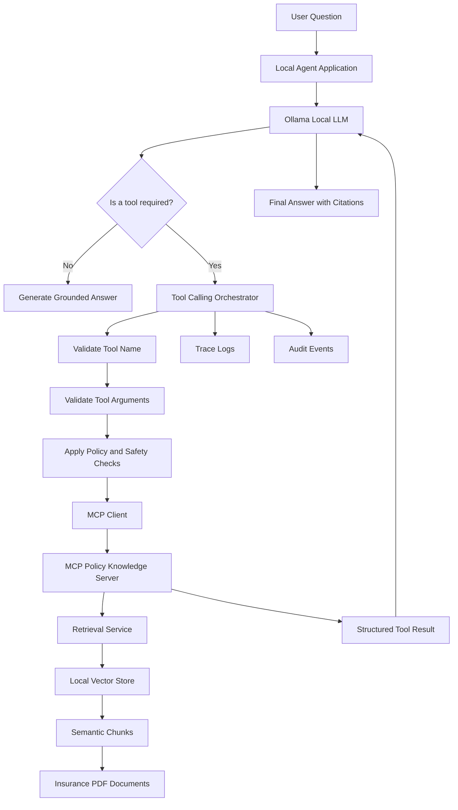
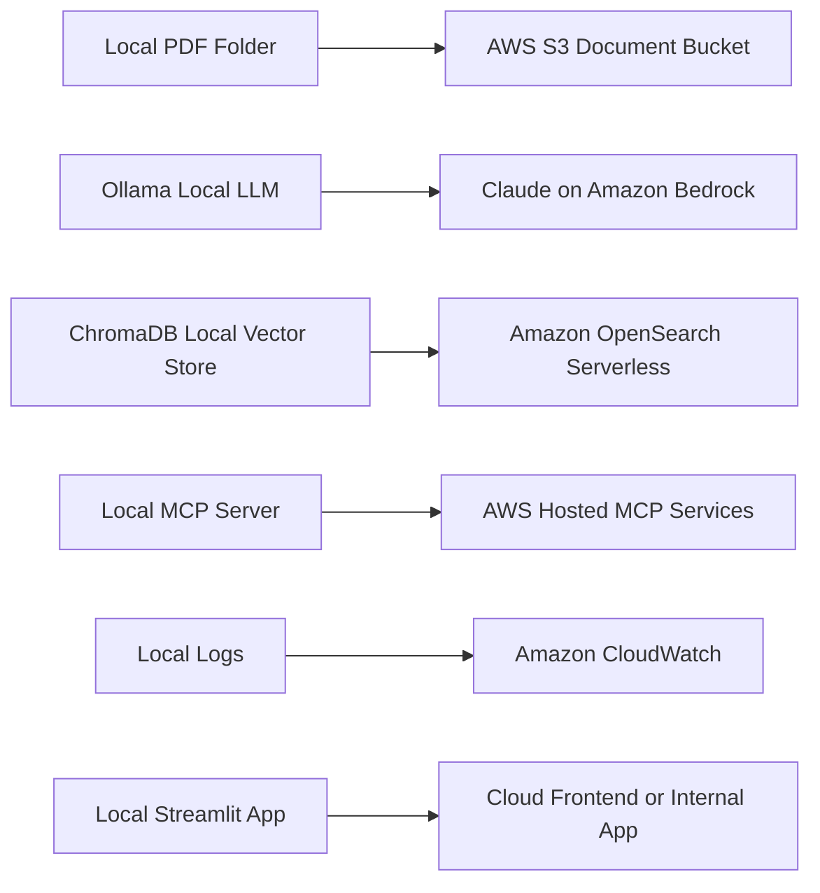
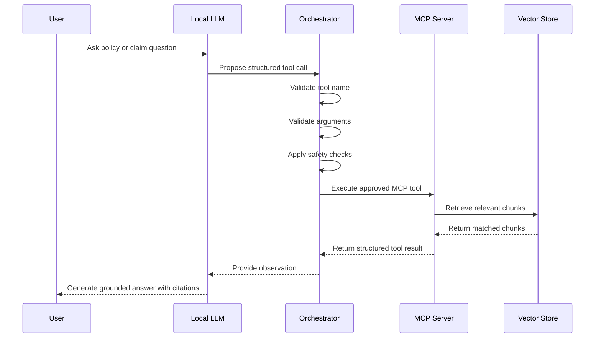
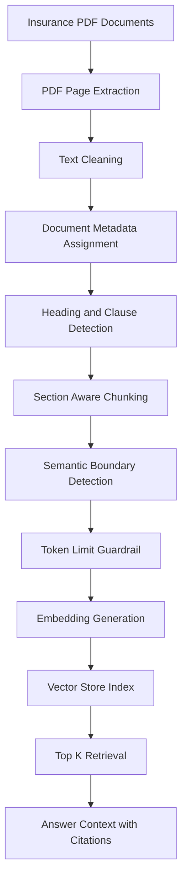
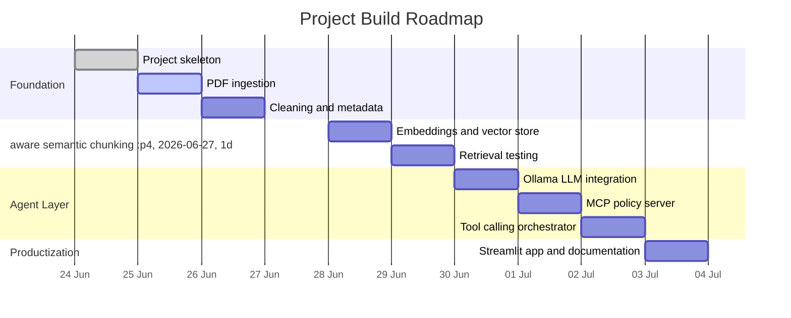

# MCP-Based Insurance Claims RAG Agent

<p align="center">
  
</p>

<p align="center">
  
  
  
  
  
  
</p>

<p align="center">
  <b>Local-first enterprise AI engineering project for insurance policy intelligence, semantic retrieval, MCP tools, and governed tool-calling workflows.</b>
</p>

---

## Project Overview

This project builds an enterprise-style AI agent for insurance claims and policy intelligence.

The system is designed to answer questions over insurance policy and regulatory documents, retrieve relevant clauses, and expose retrieval capabilities through MCP tools. The local version runs with Ollama and a local vector database. The future cloud version will migrate to Claude on Amazon Bedrock and AWS-native retrieval infrastructure.

The goal is not to create a simple chatbot. The goal is to build a governed AI system where the language model proposes actions, the orchestrator validates them, MCP tools expose controlled capabilities, and retrieval outputs remain traceable to source documents.

---

## Core Principle

```text
The model proposes.
The orchestrator validates.
The MCP server executes.
The retrieval layer provides grounded evidence.
```

---

## Current Status

| Build Part | Module                                          | Status   |
| ---------: | ----------------------------------------------- | -------- |
|          1 | Project skeleton and local environment          | Complete |
|          2 | PDF ingestion                                   | Next     |
|          3 | Cleaning and metadata extraction                | Planned  |
|          4 | Section-aware semantic chunking                 | Planned  |
|          5 | Embeddings and local vector store               | Planned  |
|          6 | Retrieval testing                               | Planned  |
|          7 | Ollama local LLM integration                    | Planned  |
|          8 | MCP policy knowledge server                     | Planned  |
|          9 | Governed tool-calling orchestrator              | Planned  |
|         10 | Streamlit app, tracing, documentation, AWS plan | Planned  |

---

## System Architecture



---

## Local-to-Cloud Migration View



---

## Tool Calling Lifecycle



---

## Retrieval Pipeline



---

## Planned Knowledge Base

The local policy documents are stored outside the Git repository.

```text
C:\Users\SSS\Desktop\AI Project\pdf policy documents
```

The documents are expected to cover these categories:

| Category            | Example Documents                               | Purpose                                               |
| ------------------- | ----------------------------------------------- | ----------------------------------------------------- |
| Policy documents    | NRMA Car Insurance PDS, NRMA Home Insurance PDS | Coverage, exclusions, claim conditions                |
| Claims handling     | AFCA claims handling guidance                   | Fair claims handling and dispute context              |
| Regulatory guidance | ASIC INFO 253, ASIC RG 271                      | Claims handling and complaint obligations             |
| Industry conduct    | General Insurance Code of Practice              | Customer treatment and industry standards             |
| Operational risk    | APRA CPS 230                                    | Enterprise risk, resilience, and operational controls |

PDF files are not committed to GitHub.

---

## Planned MCP Tools

| Tool Name                   | Purpose                                       | Risk Level |
| --------------------------- | --------------------------------------------- | ---------- |
| `search_policy_documents`   | Search policy and regulatory document chunks  | Low        |
| `get_policy_clause`         | Retrieve a specific policy section or clause  | Low        |
| `compare_policy_coverage`   | Compare claim facts against retrieved clauses | Medium     |
| `get_complaint_obligations` | Retrieve complaint handling obligations       | Low        |
| `draft_customer_response`   | Draft customer-facing claim communication     | Medium     |
| `log_audit_event`           | Record tool call and workflow trace           | Low        |

Side-effecting tools such as sending email, updating claim status, or escalating a claim will require explicit approval gates in later versions.

---

## Technology Stack

| Layer            | Local MVP                                     | Future AWS Version                                      |
| ---------------- | --------------------------------------------- | ------------------------------------------------------- |
| LLM              | Ollama local model                            | Claude on Amazon Bedrock                                |
| Embeddings       | SentenceTransformers or local embedding model | Amazon Bedrock embeddings                               |
| Vector store     | ChromaDB                                      | Amazon OpenSearch Serverless or Bedrock Knowledge Bases |
| Tool interface   | MCP Python server                             | AWS-hosted MCP services                                 |
| Orchestration    | Custom Python orchestrator                    | Containerized service or AWS Lambda/ECS                 |
| UI               | Streamlit                                     | Streamlit, React, or internal enterprise frontend       |
| Logs             | Local log files                               | Amazon CloudWatch                                       |
| Document storage | Local PDF folder                              | Amazon S3                                               |

---

## Repository Structure

```text
insurance-claims-mcp-rag/
|
|-- app/
|-- config/
|-- data/
|   |-- raw/
|   |-- processed/
|   |-- chunks/
|
|-- docs/
|-- logs/
|-- scripts/
|-- src/
|   |-- ingestion/
|   |-- chunking/
|   |-- retrieval/
|   |-- llm/
|   |-- mcp_server/
|   |-- orchestrator/
|
|-- tests/
|-- vector_store/
|-- .env.example
|-- .gitignore
|-- README.md
|-- requirements.txt
```

---

## Build Roadmap



---

## Local Setup

### 1. Clone the repository

```bash
git clone https://github.com/SwapnilMundhekar/insurance-claims-mcp-rag.git
cd insurance-claims-mcp-rag
```

### 2. Create virtual environment

```bash
python -m venv .venv
```

### 3. Activate virtual environment on Windows

```powershell
.\.venv\Scripts\Activate.ps1
```

### 4. Install dependencies

```bash
pip install -r requirements.txt
```

### 5. Create `.env`

Copy `.env.example` to `.env` and update the local PDF path.

```text
PDF_SOURCE_DIR=C:\Users\SSS\Desktop\AI Project\pdf policy documents
```

---

## Environment Variables

```text
PROJECT_NAME=insurance-claims-mcp-rag
PROJECT_ROOT=YOUR_PROJECT_PATH
PDF_SOURCE_DIR=YOUR_POLICY_PDF_FOLDER_PATH

OLLAMA_BASE_URL=http://localhost:11434
OLLAMA_MODEL=qwen2.5:7b-instruct

VECTOR_DB_DIR=.\vector_store\chroma
CHUNK_OUTPUT_DIR=.\data\chunks
PROCESSED_OUTPUT_DIR=.\data\processed
```

---

## What Part 1 Contains

Part 1 includes:

| Area                            | Implemented |
| ------------------------------- | ----------- |
| Project folder structure        | Yes         |
| Python virtual environment plan | Yes         |
| Requirements file               | Yes         |
| Git ignore rules                | Yes         |
| Environment example             | Yes         |
| Source module boundaries        | Yes         |
| PDF data excluded from GitHub   | Yes         |

---

## Next Build Step

Part 2 will implement PDF ingestion.

Expected output:

```text
data/processed/extracted_pages.json
```

The ingestion output will contain:

```json
{
  "document_name": "example-policy-document.pdf",
  "page_number": 1,
  "text": "Extracted page text..."
}
```

---

## Future Demo Assets

After the Streamlit application is built, a real demo animation will be added here:

```text
docs/assets/demo.gif
```

The README will then include:

```markdown

```

No fake demo screenshots or generated performance metrics are included in this repository.

---

## Engineering Concepts Demonstrated

This project is designed to demonstrate:

| Concept           | How it appears in the project                   |
| ----------------- | ----------------------------------------------- |
| RAG               | Retrieval over policy and regulatory documents  |
| Semantic chunking | Section-aware document splitting                |
| MCP               | Tool interface for controlled retrieval actions |
| Tool calling      | LLM proposes structured tool use                |
| Orchestration     | Python validates and executes tool requests     |
| Observability     | Trace logs and audit events                     |
| Governance        | Approval gates for risky actions                |
| Cloud migration   | Local Ollama to Claude on AWS Bedrock           |

---

## Design Constraints

The system will follow these constraints:

1. Do not commit PDFs to GitHub.
2. Do not hardcode secrets.
3. Do not allow the LLM to directly execute actions.
4. Validate every tool call before execution.
5. Preserve document metadata for citations.
6. Return uncertainty when retrieved context is insufficient.
7. Keep local development cloud-portable.

---

## Author

Swapnil Mundhekar

GitHub: [SwapnilMundhekar](https://github.com/SwapnilMundhekar)

---

## License

This project is currently for personal learning, portfolio development, and interview preparation.

A formal license can be added later.
