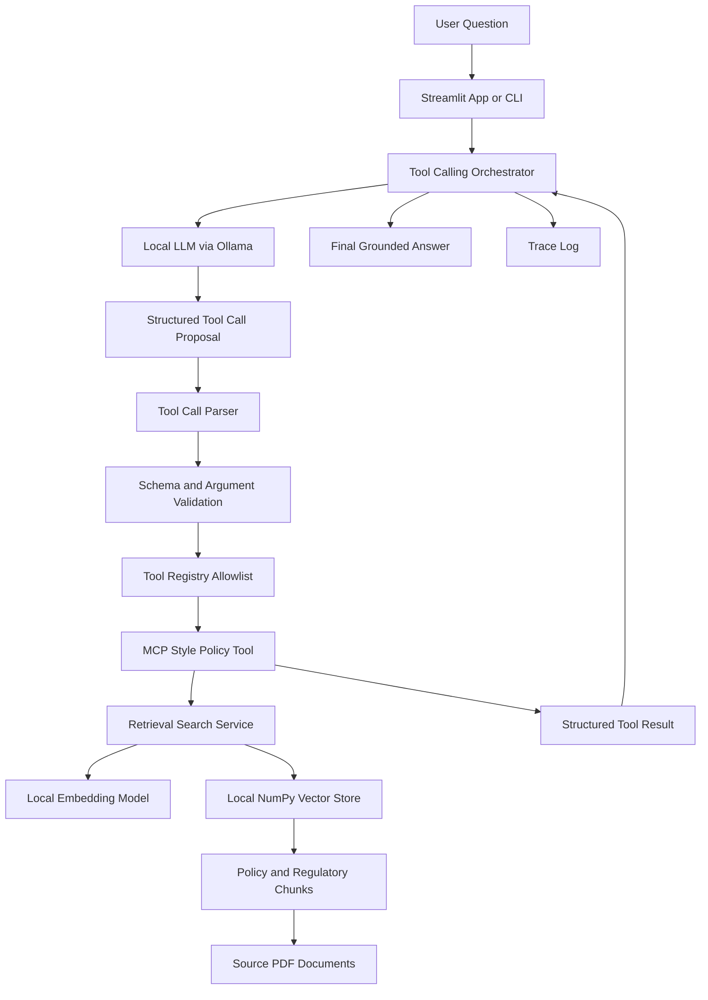
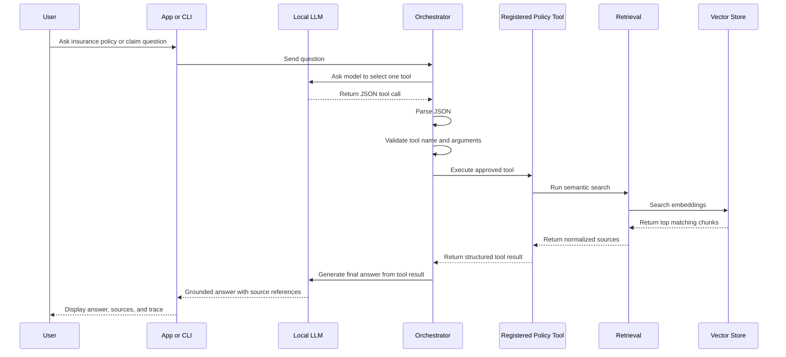
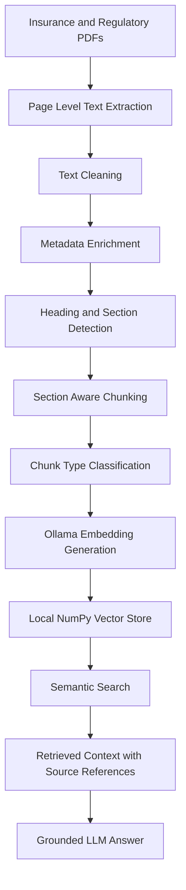
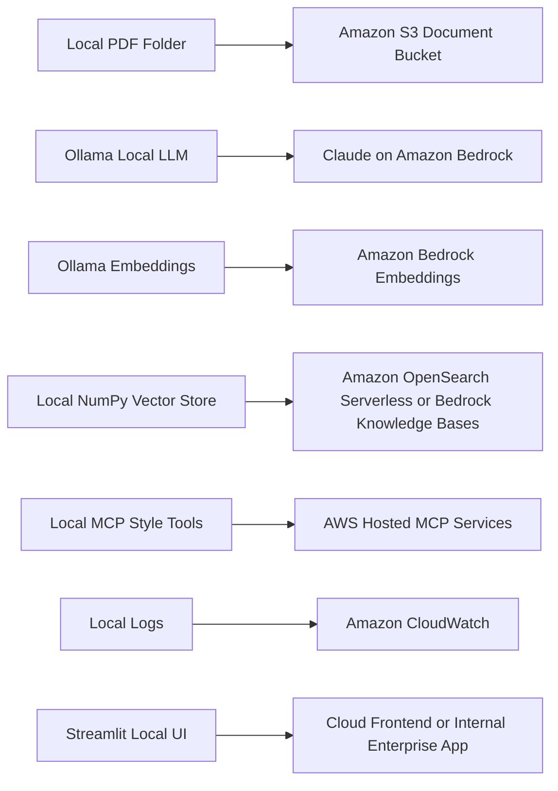
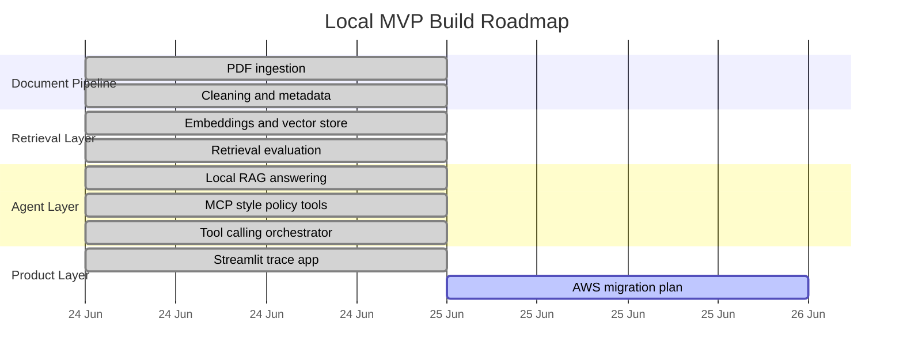
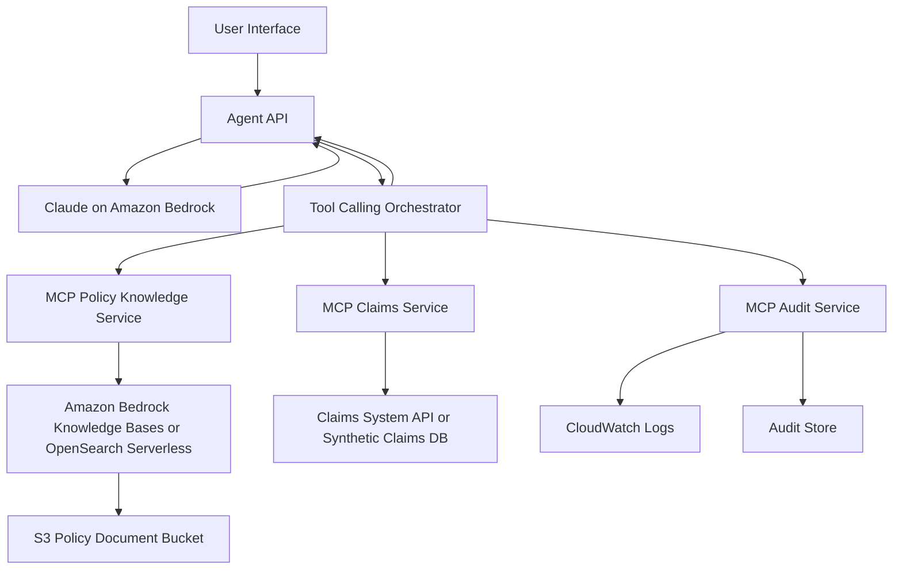

# MCP-Based Insurance Claims RAG Agent

<p align="center">
  
</p>

<p align="center">
  
  
  
  
  
  
  
</p>

<p align="center">
  <b>Local-first enterprise AI engineering project for insurance policy intelligence, semantic retrieval, MCP-style tools, and governed tool-calling workflows.</b>
</p>

---

## 1. Project Summary

This project implements a local-first insurance claims and policy intelligence agent.

The system ingests insurance and regulatory PDF documents, extracts and cleans page-level text, creates section-aware semantic chunks, generates local embeddings, stores them in a local vector store, retrieves relevant policy context, and uses a local LLM through Ollama to produce grounded answers.

The project also adds an MCP-style policy knowledge server and a governed tool-calling orchestrator. The LLM is not allowed to directly execute backend logic. It proposes a structured tool call, the orchestrator validates the tool name and arguments, the approved tool executes, and the final answer is generated from the tool result.

The project is designed as a local MVP that can later migrate to Claude on Amazon Bedrock and AWS-native retrieval infrastructure.

---

## 2. Core Design Principle

```text
The model proposes.
The orchestrator validates.
The registered tool executes.
The retrieval layer provides grounded evidence.
The final answer is generated from retrieved context only.
```

This is not a simple chatbot. It is a controlled tool-calling system with clear execution boundaries.

---

## 3. Key Capabilities

| Capability             | Description                                                                                        |
| ---------------------- | -------------------------------------------------------------------------------------------------- |
| PDF ingestion          | Reads local insurance and regulatory PDF documents page by page                                    |
| Text cleaning          | Normalizes PDF-extracted text and removes extraction noise                                         |
| Metadata enrichment    | Adds document type, provider/regulator, product type, page references, and source category         |
| Section-aware chunking | Preserves insurance document structure instead of using blind token splitting                      |
| Local embeddings       | Uses Ollama embedding model for local vector generation                                            |
| Local vector store     | Stores normalized embeddings and chunks using a lightweight NumPy-based vector store               |
| Retrieval evaluation   | Tests retrieval quality before LLM integration                                                     |
| Local RAG answering    | Uses retrieved chunks as controlled context for the LLM                                            |
| MCP-style tools        | Exposes retrieval capabilities as reusable policy tools                                            |
| Governed tool calling  | Forces the LLM to propose structured JSON tool calls that are validated before execution           |
| Streamlit UI           | Provides a local chat interface with selected tool, arguments, retrieved sources, and trace output |
| AWS migration path     | Designed to migrate from local Ollama to Claude on Amazon Bedrock                                  |

---

## 4. System Architecture



---

## 5. Tool-Calling Lifecycle



---

## 6. Retrieval Pipeline



---

## 7. MCP-Style Tool Layer

The project exposes retrieval capabilities as controlled tools.

| Tool                        | Purpose                                                               | Risk Level |
| --------------------------- | --------------------------------------------------------------------- | ---------- |
| `search_policy_documents`   | Search policy and regulatory document chunks                          | Low        |
| `get_claim_requirements`    | Retrieve evidence, claim conditions, coverage clauses, and exclusions | Low        |
| `get_complaint_obligations` | Retrieve complaint handling and dispute resolution obligations        | Low        |

The LLM does not call arbitrary Python functions. It can only propose calls to registered tools.

The orchestrator checks:

```text
1. Is the tool registered?
2. Are required arguments present?
3. Are argument types valid?
4. Is top_k within allowed limits?
5. Is the tool risk level allowed?
6. Can the tool execute without human approval?
```

---

## 8. Local-to-AWS Migration View



---

## 9. Repository Structure

```text
insurance-claims-mcp-rag/
|
|-- app/
|   |-- streamlit_app.py
|
|-- config/
|   |-- retrieval_test_queries.json
|
|-- data/
|   |-- raw/
|   |-- processed/
|   |-- chunks/
|
|-- docs/
|   |-- demo_questions.md
|
|-- logs/
|
|-- scripts/
|   |-- ingest_pdfs.py
|   |-- clean_pages.py
|   |-- chunk_pages.py
|   |-- build_vector_store.py
|   |-- query_vector_store.py
|   |-- evaluate_retrieval.py
|   |-- ask_rag.py
|   |-- test_policy_tools.py
|   |-- run_orchestrator.py
|
|-- src/
|   |-- ingestion/
|   |   |-- pdf_loader.py
|   |   |-- text_cleaner.py
|   |   |-- metadata_enricher.py
|   |
|   |-- chunking/
|   |   |-- section_detector.py
|   |   |-- chunk_builder.py
|   |
|   |-- retrieval/
|   |   |-- embedding_model.py
|   |   |-- vector_store.py
|   |   |-- search_service.py
|   |
|   |-- llm/
|   |   |-- ollama_client.py
|   |   |-- rag_answer_service.py
|   |
|   |-- mcp_server/
|   |   |-- policy_tools.py
|   |   |-- policy_server.py
|   |
|   |-- orchestrator/
|       |-- tool_registry.py
|       |-- tool_call_parser.py
|       |-- tool_orchestrator.py
|
|-- tests/
|
|-- vector_store/
|
|-- .env.example
|-- .gitignore
|-- README.md
|-- requirements.txt
```

---

## 10. Knowledge Base

The local PDF source folder is configured through `.env`.

Example:

```text
PDF_SOURCE_DIR=C:\Users\SSS\Desktop\AI Project\pdf policy documents
```

The document set is expected to include insurance and regulatory material such as:

| Document Category                  | Purpose                                                     |
| ---------------------------------- | ----------------------------------------------------------- |
| Product Disclosure Statements      | Coverage, exclusions, definitions, and claim conditions     |
| Claims handling guidance           | Fair and transparent claims handling context                |
| ASIC regulatory guidance           | Claims handling and complaint obligations                   |
| General Insurance Code of Practice | Industry conduct and customer treatment standards           |
| APRA CPS 230                       | Operational risk, resilience, and service provider controls |

PDF documents are intentionally not committed to GitHub.

---

## 11. Environment Variables

Create a local `.env` file from `.env.example`.

```text
PROJECT_NAME=insurance-claims-mcp-rag
PROJECT_ROOT=YOUR_PROJECT_PATH
PDF_SOURCE_DIR=YOUR_POLICY_PDF_FOLDER_PATH

OLLAMA_BASE_URL=http://localhost:11434
OLLAMA_MODEL=qwen2.5:7b
OLLAMA_EMBEDDING_MODEL=nomic-embed-text

VECTOR_DB_DIR=.\vector_store\local
CHUNK_OUTPUT_DIR=.\data\chunks
PROCESSED_OUTPUT_DIR=.\data\processed
```

---

## 12. Local Setup

### 12.1 Clone the repository

```bash
git clone https://github.com/SwapnilMundhekar/insurance-claims-mcp-rag.git
cd insurance-claims-mcp-rag
```

### 12.2 Create virtual environment

```bash
python -m venv .venv
```

### 12.3 Activate virtual environment on Windows

```powershell
.\.venv\Scripts\Activate.ps1
```

### 12.4 Install dependencies

```bash
pip install -r requirements.txt
```

### 12.5 Pull local Ollama models

```powershell
ollama pull qwen2.5:7b
ollama pull nomic-embed-text
```

### 12.6 Configure `.env`

Copy `.env.example` to `.env` and update the local PDF folder path.

---

## 13. Build Pipeline

Run the local build in order.

### 13.1 Ingest PDFs

```powershell
python -u scripts\ingest_pdfs.py
```

Expected local output:

```text
data/processed/extracted_pages.json
data/processed/ingestion_summary.json
```

### 13.2 Clean pages and enrich metadata

```powershell
python -u scripts\clean_pages.py
```

Expected local output:

```text
data/processed/clean_pages.json
data/processed/document_inventory.json
```

### 13.3 Build section-aware chunks

```powershell
python -u scripts\chunk_pages.py
```

Expected local output:

```text
data/chunks/policy_chunks.json
data/chunks/chunking_summary.json
```

### 13.4 Build local vector store

```powershell
python -u scripts\build_vector_store.py
```

Expected local output:

```text
vector_store/local/chunks.json
vector_store/local/embeddings.npy
data/processed/vector_store_summary.json
```

### 13.5 Query vector store

```powershell
python -u scripts\query_vector_store.py
```

### 13.6 Evaluate retrieval

```powershell
python -u scripts\evaluate_retrieval.py
```

Expected local output:

```text
data/processed/retrieval_test_results.json
data/processed/retrieval_test_report.md
```

### 13.7 Ask RAG question

```powershell
python -u scripts\ask_rag.py "Is accidental damage covered under car insurance?"
```

### 13.8 Test policy tools

```powershell
python -u scripts\test_policy_tools.py
```

### 13.9 Run governed tool-calling orchestrator

```powershell
python -u scripts\run_orchestrator.py "What evidence is required for a car insurance claim?"
```

### 13.10 Run Streamlit app

```powershell
python -m streamlit run app\streamlit_app.py
```

---

## 14. Example Questions

Use these questions to test the system.

```text
Is accidental damage covered under car insurance?
```

```text
What evidence is required for a car insurance claim?
```

```text
What are complaint handling obligations under ASIC RG 271?
```

```text
What does the General Insurance Code of Practice say about claims handling?
```

```text
What does CPS 230 say about operational risk management?
```

```text
What does CPS 230 say about material service providers?
```

---

## 15. Streamlit App View

The local Streamlit app shows:

| Panel             | Purpose                                                                         |
| ----------------- | ------------------------------------------------------------------------------- |
| Chat              | User question and final grounded answer                                         |
| Selected Tool     | Tool chosen by the LLM                                                          |
| Tool Arguments    | Validated JSON arguments sent to the tool                                       |
| Tool Result Count | Number of retrieved chunks                                                      |
| Retrieved Sources | Document names, page ranges, section titles, chunk types, and source references |
| Raw Trace JSON    | Full execution trace for debugging and auditability                             |

Future demo animation location:

```text
docs/assets/demo.gif
```

Once a real demo GIF is recorded, it can be added with:

```markdown

```

No fake demo screenshot or fake performance graph is included.

---

## 16. Build Roadmap



---

## 17. Engineering Decisions

### 17.1 Why local first?

Local development allows faster iteration, lower cost, and easier debugging before moving to AWS.

### 17.2 Why Ollama?

Ollama provides a simple local runtime for LLM and embedding models. It avoids cloud cost during the MVP phase.

### 17.3 Why local NumPy vector store?

The local vector store is lightweight, transparent, and stable for development. It stores normalized embeddings in `embeddings.npy` and chunks in `chunks.json`.

For AWS, this can be replaced with OpenSearch Serverless, Bedrock Knowledge Bases, or another managed vector store.

### 17.4 Why MCP-style tools?

MCP-style tools create a clean boundary between the agent and backend capabilities. Tools have names, descriptions, schemas, and execution ownership.

### 17.5 Why not let the LLM execute directly?

The LLM should not execute arbitrary functions. It should propose actions. The application should validate and execute only approved tools.

---

## 18. Retrieval Evaluation

The project includes a retrieval evaluation suite using predefined test queries.

The evaluation checks:

| Metric                        | Meaning                                                                     |
| ----------------------------- | --------------------------------------------------------------------------- |
| Top 1 document type match     | Whether the first retrieved chunk comes from the expected document category |
| Top 3 any document type match | Whether any of the top 3 chunks match the expected document category        |
| Chunk type match              | Whether the retrieved chunk type is relevant to the question                |
| Source traceability           | Whether page and document references are preserved                          |

Generated report:

```text
data/processed/retrieval_test_report.md
```

This report is local-only and is not committed to GitHub.

---

## 19. Tool Trace Example

Each governed tool-calling run saves a trace under:

```text
logs/
```

A trace includes:

```json
{
  "user_question": "What evidence is required for a car insurance claim?",
  "tool_selection": {
    "tool_call": {
      "tool_name": "get_claim_requirements",
      "arguments": {
        "query": "evidence required for car insurance claim",
        "top_k": 5
      }
    }
  },
  "tool_execution": {
    "tool_name": "get_claim_requirements",
    "risk_level": "low",
    "result": {
      "result_count": 5
    }
  },
  "final_answer": "Based on the retrieved context..."
}
```

Trace logs are ignored by Git because they are runtime artifacts.

---

## 20. Security and Governance Model

The local MVP includes basic governance controls.

| Control                 | Implementation                                                |
| ----------------------- | ------------------------------------------------------------- |
| Tool allowlist          | Only registered tools can execute                             |
| Schema validation       | Tool calls must include valid `query` and `top_k` arguments   |
| Risk gating             | Only low-risk tools execute automatically                     |
| No arbitrary execution  | The LLM cannot call unregistered Python functions             |
| Local secrets           | `.env` is excluded from Git                                   |
| Local runtime artifacts | PDFs, chunks, vector store, and logs are excluded from Git    |
| Traceability            | Tool selection, arguments, result, and final answer are saved |

Future enterprise controls:

| Future Control       | AWS Direction                          |
| -------------------- | -------------------------------------- |
| Authentication       | IAM, Cognito, or enterprise SSO        |
| Authorization        | Role-based tool access                 |
| Audit logging        | CloudWatch and structured audit tables |
| Document storage     | S3 with bucket policies                |
| Model governance     | Amazon Bedrock model access controls   |
| Retrieval governance | OpenSearch metadata filtering          |
| Human approval       | Approval gate for side-effecting tools |

---

## 21. Limitations

This project is a local MVP.

Current limitations:

1. It uses local synthetic or manually selected documents.
2. It does not make final legal, regulatory, or claim decisions.
3. It does not send emails or update claim systems.
4. It does not yet use a production MCP client session for all tool invocation flows.
5. It does not include real customer, policyholder, or private claim data.
6. It does not include cloud deployment yet.
7. Retrieval quality depends on PDF extraction quality, chunking quality, and embedding relevance.
8. The local vector store is suitable for development, not enterprise-scale retrieval.

---

## 22. Future Enhancements

Planned enhancements:

| Enhancement              | Description                                                           |
| ------------------------ | --------------------------------------------------------------------- |
| Production MCP client    | Use a full MCP client session to call MCP server tools                |
| Hybrid retrieval         | Combine semantic search with keyword search                           |
| Reranking                | Add a reranker to improve top-k relevance                             |
| Better section detection | Improve clause and heading detection for complex PDFs                 |
| Evaluation dataset       | Add labelled retrieval and answer-quality test cases                  |
| Human approval           | Add approval workflow for medium/high-risk tools                      |
| AWS deployment           | Move LLM to Claude on Bedrock                                         |
| Managed vector DB        | Move vector store to OpenSearch Serverless or Bedrock Knowledge Bases |
| Observability            | Add structured logs and latency tracking                              |
| Demo GIF                 | Add real Streamlit walkthrough animation                              |

---

## 23. AWS Target Architecture



---

## 24. What This Project Demonstrates

This project demonstrates senior AI engineering concepts:

| Area                 | Demonstrated By                                                       |
| -------------------- | --------------------------------------------------------------------- |
| RAG architecture     | Document ingestion, chunking, embeddings, retrieval, grounded answers |
| Tool calling         | LLM-generated structured tool proposals                               |
| MCP architecture     | Tool definitions and server-side policy tools                         |
| Orchestration        | Validation, allowlist execution, risk control, trace logging          |
| LLMOps thinking      | Retrieval evaluation, local-first testing, traceability               |
| Enterprise AI design | Governance, approval boundaries, auditability, migration path         |
| Cloud readiness      | Clear path from local Ollama to Claude on AWS Bedrock                 |

---

## 25. Author

Swapnil Mundhekar

GitHub: [SwapnilMundhekar](https://github.com/SwapnilMundhekar)

---

## 26. License

This project is currently for personal learning, portfolio development, and interview preparation.

A formal license can be added later.
